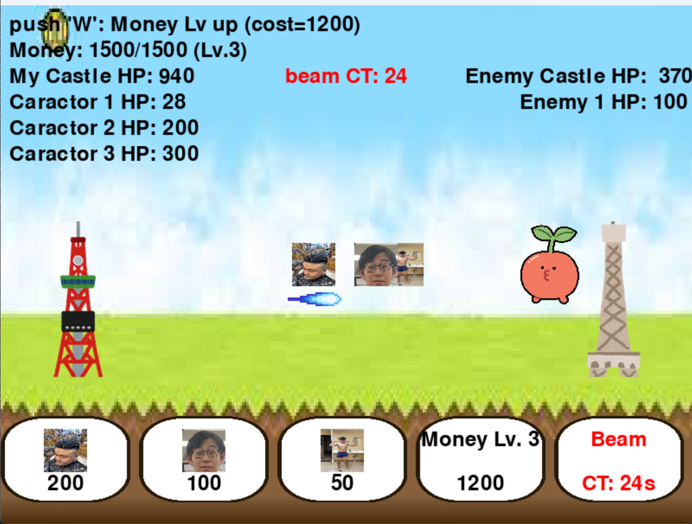

# こうかとん戦争

## 実行環境の必要条件
* python >= 3.10
* pygame >= 2.1

## ゲームの概要
* タイトル画面があり、BGMが流れる。
* 敵の城を落とすゲーム
* 参考URL：[にゃんこ大戦争](https://programming-school-technolo.com/?page_id=2621)

## ゲームの遊び方
* お金を使用して、なかまを召喚する（カーソルキーからでも可）（1(cost 10),2(cost 50),3(cost150)のキーで召喚）
* 自分のタイミングで、仲間を召喚して、城を壊滅に追い込む
* 敵を倒すとお金とビームのクールタイムが速くなる(Qでビーム発射)（カーソルキーからでも可） 
* 資金の最大値の８割を消費して、資金レベルを上げることができる（Wで実行）（カーソルキーからでも可）

## ゲームの実装
### 共通基本機能
* こうかとんビーム

### 分担追加機能
* タワー作成（担当：倉持）
* スタート画面、エンディング、BGM（担当：山田）
* 味方キャラクター作成（担当：高畑）
* 敵キャラクター作成、ビーム判定、爆発エフェクト（担当：成田）
* お金システム（担当：戸塚）

### ToDo
- [ ] BGM追加
- [ ] ビームクールタイム実装

### メモ
* 
* 
